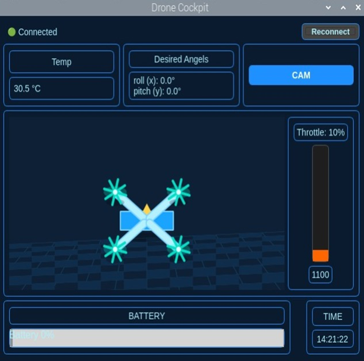
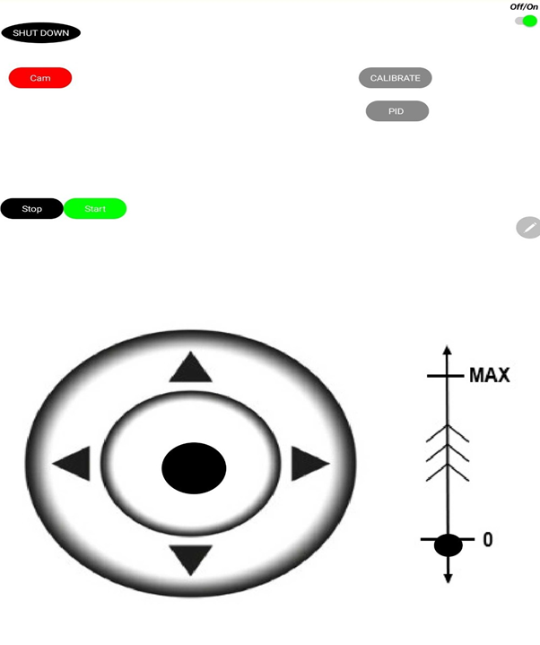

# ESP32-S3 Quadcopter Flight Controller

## Project Overview
This project implements a real-time flight controller for a quadcopter based on the ESP32-S3 microcontroller.
The system integrates control algorithms, sensor fusion, and wireless communication into a complete
hardware-firmware solution, developed and tested on a real platform.

## System Architecture
- ESP32-S3 microcontroller
- MPU6050 IMU (accelerometer and gyroscope)
- PID-based attitude control
- Wi-Fi communication for control and telemetry
- Motor drivers and ESCs
  
 ## 🖥️ System Interfaces

| **Ground Station (RPi 5)** | **Mobile Controller** |
| :---: | :---: |
|  |  |
| Real-time 3D Telemetry | Low-latency Manual Flight Control |

## 🖥️ System Interfaces

| **Ground Station (RPi 5)** | **Mobile Controller** |
| :---: | :---: |
|  |  |
| Real-time 3D Telemetry | Low-latency Manual Flight Control |

## Key Features
- Real-time PID flight control
- Sensor fusion using IMU data
- Wireless control and telemetry over Wi-Fi
- Full hardware-firmware integration

## Repository Structure
- ESP32_FlightController        – ESP32-S3 flight controller firmware (C++)
- Final_Project_Report_Book     – Project documentation and report
- RaspberryPi_App               – Raspberry Pi 5 control application
- Remote_Controller             – Mobile remote control application (MIT App Inventor source)
 

## Tools & Technologies
- Languages: C++, Python
- Protocols: I2C, UART, PWM, WebSockets
- Algorithms: Kalman Filter, PID Control, Sensor Fusion
- Platforms: ESP32-S3, Raspberry Pi 5, MIT App Inventor

